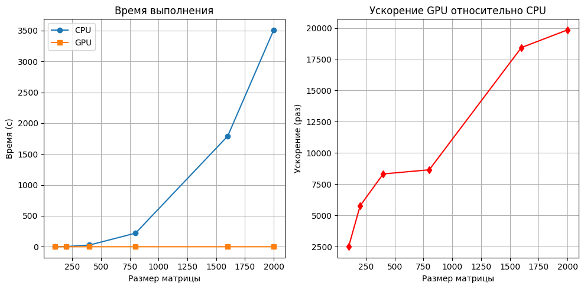
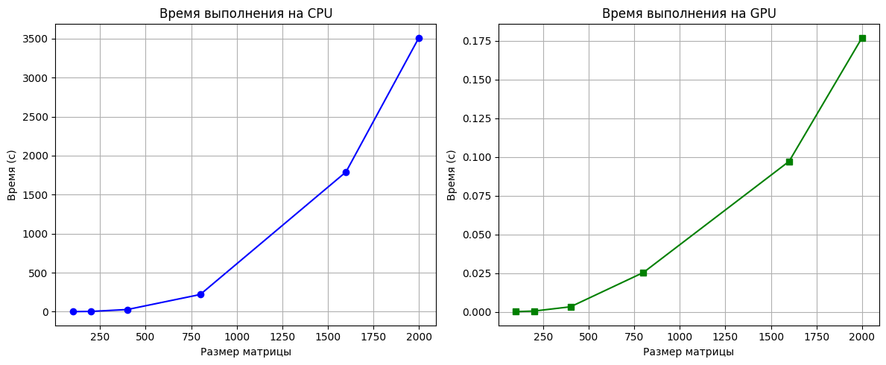

## Задание на лабораторную работу: 
Задача: реализовать алгоритм перемножения матриц

Язык: C++ или Python

Входные данные: 2 матрицы размером от 100х100 до 2000х2000 каждая.

Выходные данные: проверка корректности перемножения + время вычисления

Реализация должна содержать 2 функции перемножения матриц: на CPU(mult_matr_cpu) и на GPU(mult_matr_gpu) с применением CUDA.

## Язык программирования и среда разработки
Язык: Python

Среда: Google Collab(т.к. ноутбук не имеет встроенной CUDA)

## Описание реализации

Для **CPU** - функция mult_matr_cpu. Используется трехуровневый вложенный цикл: внешний - перебирает строки матрицы А, средний - перебирает столбцы матрицы В, внутренний - выполняет скалярное произведение элементов строки матрицы А и столбца матрицы В. Возвращает матрицу произведения и время, которое было затрачено.

Для **GPU** - функция mult_matr_gpu. Первоначально матрицы копируются с хоста на девайс, после чего выделяется память на результирующую матрицу. Задается сетка потоков и количество блоков в ней. Выполняется "прогрев" CUDA, т.к. первая компиляция при JIT-компиляции превышает время для всех дальнейших расчетов. В функции mat_mul (используется внутри функции mult_matr_gpu) один цикл, каждый поток вычисляет значение для своего элемента C[i;j]. Возращает функция результирующую матрицу и среднее время для всех прогонов, которое было затрачено.  

## А зачем нужна параллельная работа? 
Потому что задание такое:)

А если серьезно, то данная задача создана для распараллеливания, так как в ней есть: 

1) Высокая сложность. Рассмотрим функцию CPU. За счет 3 вложенных циклов ее сложность - O(n^3). То есть время, которое затрачивается на выполнение задачи, измеряется в секундах, а то и минутах.

2) Независимость вычислений (подразумевается, что выполнение операций не зависит от предыдущих действий).

## Что распараллеливаем? 

В CPU-версии три вложенных цикла:
1) По строкам i
2) По столбцам j
3) По общему индексу k (скалярное произведение)

Распараллелены два внешних цикла (i и j). В версии для GPU они полностью исчезли. Вместо того чтобы один процессор последовательно обходил каждую ячейку матрицы одну за другой, видеокарта берет на себя вычисление всех ячеек одновременно.

## А как?

Распараллеливание достигнуто за счет архитектуры CUDA и библиотеки Numba.

1) Индексация через потоки - cuda.grid(2). Каждый поток (Thread) на видеокарте получает свой уникальный номер i (номер строки) и j (номер столбца).

2) Вместо того чтобы заставлять одну функцию считать всю матрицу, мы запускаем тысячи копий функции gpu_mat_mul. Каждая копия (поток) «знает», за какую именно ячейку она отвечает.

3) Матрица разбивается на блоки потоков. Эти блоки распределяются по мультипроцессорам видеокарты, что позволяет задействовать всю мощь GPU.

Внутри каждого потока остался один цикл for k in range(A.shape[1]). Вычисление скалярного произведения (сумма произведений элементов строки на элементы столбца) в данном конкретном коде выполняется последовательно внутри каждого потока.

## Результаты эксперимента

| Размер | Время CPU (мс) | Время GPU (мс) | Ускорение | Корректность CPU | Корректность GPU |
|-------:|----------------:|----------------:|----------:|-----------------:|-----------------:|
|    100 |        0.408121 |        0.000163 | 2502.124132 |             True |             True |
|    200 |        3.068220 |        0.000531 | 5779.109289 |             True |             True |
|    400 |       27.384048 |        0.003289 | 8326.563170 |             True |             True |
|    800 |      219.903466 |        0.025404 | 8656.418864 |             True |             True |
|   1600 |     1790.942333 |        0.097150 |18434.762002|             True |             True |
|   2000 |     3510.975138 |        0.176882 |19849.270573|             True |             True |

Как можно судить из графиков времени, затраченного на подсчет произведения матриц, время выполнения на GPU в тысячи раз меньше, чем время выполнения на CPU.

Время и для GPU, и для CPU растет экспоненциально, хоть при наложении графиков друг на друга и кажется, что GPU возрастает линейно.
Ускорение растет довольно резко, близко к экспоненциальному виду, это связано с тем, что сложность выполнения на CPU увеличивается намного сильнее, чем сложность на GPU => время также меняется намного сильнее у CPU.
Все полученые результаты - корректны в сравнении с эталонной матрицей до 5 знака.

## Итог

Результаты реализации показывают, что применение распараллеливания в данной задаче показано, так как несет значительную экономию времени, что ускоряет процесс работы.
