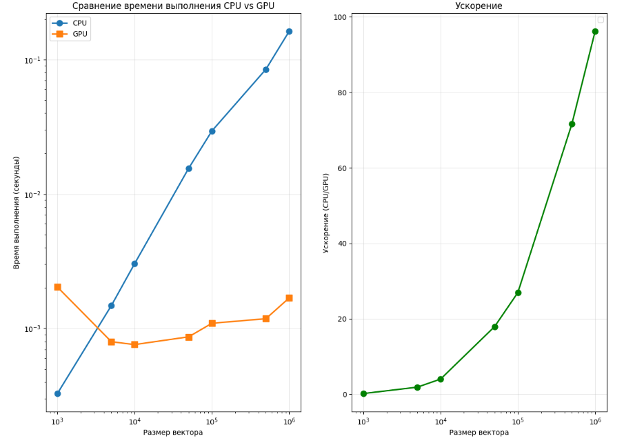

## Задание на лабораторную работу

Задача: реализовать алгоритм сложения элементов вектора

Язык: C++ или Python

Входные данные: Вектор размером 1 000..1 000 000 значений.

Выходные данные: сумма элементов вектора + время вычисления

## Язык программирования и среда разработки
Язык: Python

Среда: Google Collab(т.к. ноутбук не имеет встроенной CUDA)

## Описание реализации

CPU: сложение осуществляется последовательным проходом по всем элементам вектора в цикле for и накоплением суммы в переменной result.

GPU: вектор разбивается на блоки по 512 нитей. Каждая нить загружает свой элемент в shared memory блока. Внутри блока выполняется иерархическое суммирование (цикл с уменьшением шага в 2 раза) — на каждом шаге нити суммируют свои значения с соседними, результат накапливается в temp[0]. Затем нулевая нить каждого блока прибавляет сумму блока к глобальному результату с помощью атомарной операции, чтобы избежать гонок данных.

## Причины необходимости распараллеливания

Распараллеливание необходимо для ускорения вычислений при работе с большими векторами. Последовательное сложение (CPU) выполняется за *O(n)*, что при размерах в миллионы элементов становится узким местом. Использование GPU позволяет одновременно задействовать тысячи нитей: каждая нить обрабатывает свой элемент, а редукция в shared memory суммирует результаты параллельно, снижая время выполнения на порядки.

## Что было распараллелено

Распараллелен процесс суммирования элементов вектора: загрузка элементов в shared memory и последующая параллельная редукция внутри каждого блока.

## Результаты эксперимента

| Размер вектора | Время на CPU (с) | Время на GPU (с) | Ускорение |
|----------------|------------------|------------------|-----------|
| 1000           | 0.000328         | 0.002033         | 0.161351  |
| 5000           | 0.001481         | 0.000797         | 1.859066  |
| 10000          | 0.003038         | 0.000759         | 4.002828  |
| 50000          | 0.015525         | 0.000867         | 17.913618 |
| 100000         | 0.029441         | 0.001093         | 26.938482 |
| 500000         | 0.084674         | 0.001182         | 71.616657 |
| 1000000        | 0.162256         | 0.001687         | 96.191237 |

Рассмотрим график времени:

Для CPU время возрастает линейно с увеличиением количества элементов, для GPU же менее выраженно возрастание, что говорит о большей эффективности данной технологии для данной задачи(однако заметно, что на небольших векторах быстрее справляется CPU, то есть GPU эффективен только на больших значениях).

Таким образом, для малых векторов наиболее эффективен CPU из-за малых накладных расходов, для больших векторов же выгодно GPU, так как создание грида и потоков окупается сокращением времени суммирования элементов.