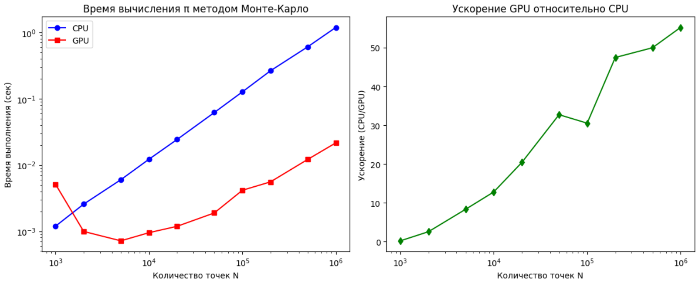
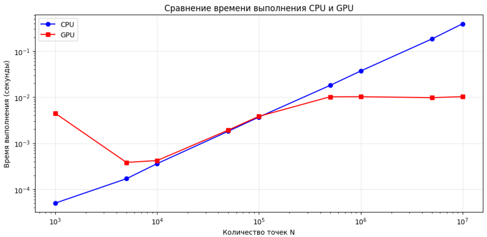
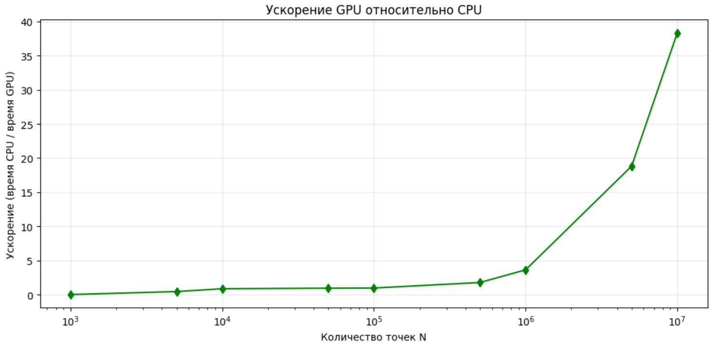

## Задание на лабораторную работу

**Задача:** реализовать вычисление числа π методом Монте-Карло 

**Язык:** C++ (или Pyhon)

**Входные данные:** N – количество случайных точек (целое число)

**Выходные данные:** время выполнения CPU и GPU, значение π, полученное на CPU и GPU, ускорение

## Язык программирования и среда разработки

**Язык:** Python (1 реализация), C++ (2 реализация)

**Среда разработки:** Google Collab (т.к. ноутбук не имеет встроенной CUDA)

## Описание реализации

**CPU:** функция monte_carlo_cpu генерирует N случайных точек. Для каждой точки вычисляются координаты (x, y) в диапазоне [0,1), проверяется условие x² + y² ≤ 1. Подсчитывается количество попаданий, после чего π вычисляется как 4 * count / N. 

**GPU:** Глобальное ядро monte_carlo_gpu_kernel запускается с параметрами: blocks_per_grid (до 1024 блоков) и threads_per_block (256 нитей). Каждая нить инициализирует собственный генератор и генерирует координаты. Для снижения конкуренции за атомарную операцию используется локальный счётчик, который после цикла прибавляется к глобальному.
Рассчет итогов по формуле: π = 4.0 * count / N.

## Причины необходимости распараллеливания

В задаче требуется сгенерировать и обработать большое количество точек, поэтому у задачи высокая сложность. Также у операции независимы друг от друга, что снова является знаком для возможного распараллеливания решения.

## Что было распараллелено

Генерация случайных точек и проверка условия x² + y² ≤ 1.

## Результаты эксперимента

**Python:**

| N         | π (CPU)  | Время CPU (сек) | π (GPU)  | Время GPU (сек) | Ускорение (CPU/GPU) |
|-----------|----------|-----------------|----------|-----------------|---------------------|
| 1000      | 3.152000 | 0.001190        | 3.216000 | 0.005094        | 0.233657            |
| 2000      | 3.152000 | 0.002560        | 3.208000 | 0.000990        | 2.584950            |
| 5000      | 3.155200 | 0.005981        | 3.125600 | 0.000715        | 8.365671            |
| 10000     | 3.161600 | 0.012174        | 3.169600 | 0.000949        | 12.830932           |
| 20000     | 3.153800 | 0.024200        | 3.147400 | 0.001184        | 20.436450           |
| 50000     | 3.137680 | 0.061648        | 3.131120 | 0.001883        | 32.733187           |
| 100000    | 3.144160 | 0.126567        | 3.142320 | 0.004143        | 30.547218           |
| 200000    | 3.148080 | 0.263311        | 3.145820 | 0.005547        | 47.469729           |
| 500000    | 3.143616 | 0.604688        | 3.142952 | 0.012099        | 49.976871           |
| 1000000   | 3.139652 | 1.187122        | 3.141756 | 0.021499        | 55.218215           |

**C++:**

| N         | CPU Pi    | CPU Time (s) | GPU Pi    | GPU Time (s) | Speedup |
|-----------|-----------|--------------|-----------|--------------|---------|
| 1000      | 3.132000  | 0.0001       | 3.176000  | 0.0045       | 0.01    |
| 5000      | 3.173600  | 0.0002       | 3.108000  | 0.0004       | 0.44    |
| 10000     | 3.151200  | 0.0004       | 3.115600  | 0.0004       | 0.86    |
| 50000     | 3.136800  | 0.0018       | 3.146160  | 0.0019       | 0.94    |
| 100000    | 3.140840  | 0.0037       | 3.137280  | 0.0038       | 0.96    |
| 500000    | 3.141288  | 0.0180       | 3.139024  | 0.0102       | 1.77    |
| 1000000   | 3.142416  | 0.0370       | 3.139468  | 0.0102       | 3.63    |
| 5000000   | 3.140870  | 0.1837       | 3.142126  | 0.0098       | 18.82   |
| 10000000  | 3.141570  | 0.3925       | 3.141131  | 0.0102       | 38.34   |

Для CPU время возрастает линейно, для GPU почти линейно, ускорение же возрастает экспоненциально (на С++ это сильно выражено, на Python менее ярко).

Анализируя результаты, можно заметить, что для каждого языка наступает момент, когда время создания грида и потоков начинает окупаться (то есть время на затраты создания нивелируются малым количеством времени на подсчет операций). Объяснить, почему в Python "оправдание" использование GPU наступает на более малом количестве точек, чем в C++, можно тем, что Python - интерпретируемый язык, в отличие от С++, то есть он более "медленно" выполняет операции, чем его компилируемый оппонент. Однакодля обеих реализаций можно сделать общий вывод - использование GPU оправданно, если только не используем параллелизм на малых количествах (до 2000 на Python и до 100 000 на С++). 