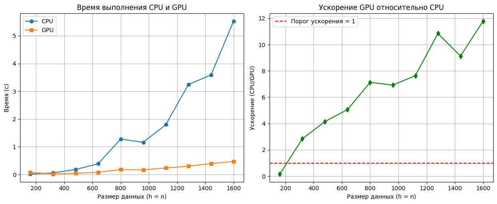
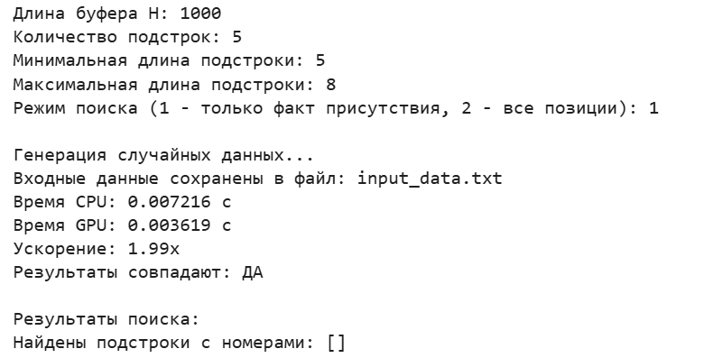

## Задание на лабораторную работу

**Задача:** реализовать поиск подстрок

**Язык:** C++/Python

**Входные данные:** матрицы строк с различными размерностями, параметры

**Выходные данные:** время выполнения CPU и GPU, отчет о совпадениях на основе результатов, полученных на CPU и GPU, ускорение

## Язык программирования и среда разработки

**Язык:** Python 

**Среда разработки:** Google Collab (т.к. ноутбук не имеет встроенной CUDA)

## Описание реализации

**CPU:** Сначала создаётся матрица, где для каждой подстроки и каждой позиции в буфере хранится оставшаяся длина подстроки. Затем при проходе по буферу для каждого символа уменьшаются счётчики в тех строках и колонках, где этот символ совпадает с соответствующим символом подстроки. В конце нулевые ячейки указывают на найденные вхождения. 

**GPU:** Данные подстрок преобразуются в компактные массивы и копируются в видеопамять. Запускается двумерное ядро, где каждый поток обрабатывает одну ячейку матрицы и атомарно уменьшает счётчик при совпадении символа. После синхронизации результат копируется обратно.

## Причины необходимости распараллеливания

Алгоритм массового поиска имеет высокую вычислительную сложность (O(n × сумма длин подстрок)). Распараллеливание на GPU позволяет обрабатывать тысячи ячеек матрицы R одновременно, что даёт значительный выигрыш во времени на больших объёмах данных. 

## Что было распараллелено

В GPU параллельно обрабатываются все пары (номер подстроки, позиция в буфере) – для каждой такой пары запускается отдельный поток. Каждый поток проверяет, совпадает ли символ буфера с соответствующим символом подстроки, и при совпадении атомарно уменьшает счётчик в соответствующей ячейке матрицы R.

## Результаты эксперимента

| Размер      | Время CPU (с) | Время GPU (с) | Ускорение | Совпадение  |
|-------------|---------------|---------------|-----------|-------------|
| 160         | 0.011155      | 0.072863      | 0.153091  | True        |
| 320         | 0.059492      | 0.020920      | 2.843799  | True        |
| 480         | 0.180352      | 0.043430      | 4.152666  | True        |
| 640         | 0.384410      | 0.075885      | 5.065687  | True        |
| 800         | 1.277685      | 0.179226      | 7.128903  | True        |
| 960         | 1.159819      | 0.167567      | 6.921545  | True        |
| 1120        | 1.798285      | 0.235526      | 7.635188  | True        |
| 1280        | 3.244693      | 0.299191      | 10.844906 | True        |
| 1440        | 3.587256      | 0.393021      | 9.127389  | True        |
| 1600        | 5.529410      | 0.469339      | 11.781264 | True        |

Как видно из графиков, время CPU возрастает практически квадратично с увеличением объема данных. Время на GPU растет же скорее линейно и менее активно, чем на CPU. При использовании GPU тратится меньшее количество времени, начиная с размера = 320. 

Из результатов эксперимента видно, что параллелизация необходима для больших объёмов данных, но текущая реализация имеет ограничения из-за активного использования атомарных операций и неоптимального отображения задачи на GPU. При отсутствии атомарных операций можно было бы добиться более значимого ускорения. 

Совпадение результатов CPU и GPU говорит о корректности алгоритма.

Также в программе реализован ручной ввод всех параметров и сохранение данных в файл формата txt.

